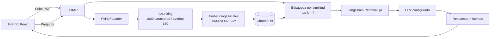

# API RAG con FastAPI y embeddings locales

[](https://www.python.org/)
[](https://fastapi.tiangolo.com/)
[](https://www.docker.com/)
[](#licencia)

API de *Retrieval-Augmented Generation* (RAG) que indexa documentos PDF y responde preguntas usando únicamente sus fragmentos más relevantes como contexto. Permite consultar información documental mediante una API reproducible y contenerizada.

## Características principales

- API HTTP construida con **FastAPI**, con validación de datos y documentación Swagger automática.
- Interfaz responsive construida con **React 19**, **TypeScript**, **Vite 8** y **Tailwind CSS 4**.
- Frontend y API publicados por FastAPI desde el mismo origen, sin configuración CORS.
- Pipeline RAG orquestado con **LangChain**.
- Ingesta de archivos PDF mediante endpoint o durante el arranque del servicio.
- Fragmentación configurable en bloques de 1.000 caracteres con 150 caracteres de solapamiento.
- Embeddings generados localmente con `sentence-transformers/all-MiniLM-L6-v2`.
- Mayor privacidad: el contenido usado para generar los embeddings no se envía a una API de embeddings externa.
- Costo cero de inferencia para embeddings. La generación de respuestas sí utiliza el proveedor LLM configurado.
- Persistencia del índice vectorial en **ChromaDB**.
- Recuperación semántica de los cuatro fragmentos más relevantes para cada consulta.
- Compatibilidad con Anthropic, NVIDIA NIM, Groq y OpenRouter como proveedores del LLM.
- Ejecución 100 % en Docker, incluido el servicio de API, el pipeline RAG y ChromaDB.
- Volumen persistente para conservar documentos e índices al recrear el contenedor.

## Tecnologías y herramientas

| Área | Tecnología | Uso en el proyecto |
|---|---|---|
| Backend | Python 3.11, FastAPI y Uvicorn | API HTTP, validación, documentación OpenAPI y servidor ASGI |
| Pipeline RAG | LangChain | Carga, fragmentación, recuperación y composición de la cadena de preguntas y respuestas |
| Documentos | PyPDF y `PyPDFLoader` | Extracción del contenido y los metadatos de archivos PDF |
| Embeddings | Hugging Face y `sentence-transformers/all-MiniLM-L6-v2` | Generación local de representaciones vectoriales |
| Base vectorial | ChromaDB | Persistencia y búsqueda semántica de fragmentos |
| Frontend | React 19, TypeScript, Vite 8 y Tailwind CSS 4 | Interfaz para subir documentos y consultar al agente |
| Infraestructura | Docker y Docker Compose | Construcción y ejecución reproducible de toda la aplicación |
| Despliegue | Oracle Cloud Infrastructure y Ubuntu 24.04 | Alojamiento de la aplicación en una instancia Compute |
| Generación | Anthropic, NVIDIA NIM, Groq u OpenRouter | Proveedor configurable del LLM que redacta la respuesta final |

## Arquitectura y funcionamiento del RAG

El sistema separa la API, la carga documental, el pipeline RAG y la selección del LLM en módulos independientes. El flujo completo es:

1. **Ingesta:** se recibe un PDF desde `POST /documents/upload` o desde la ruta indicada en `PDF_PATH`.
2. **Chunking:** `PyPDFLoader` extrae el contenido y `RecursiveCharacterTextSplitter` lo divide en fragmentos.
3. **Embeddings:** el modelo local `all-MiniLM-L6-v2` convierte cada fragmento en un vector.
4. **Almacenamiento:** ChromaDB persiste los vectores y sus metadatos dentro de `/data`.
5. **Recuperación:** ante una pregunta, se buscan por similitud los cuatro fragmentos más relevantes.
6. **Generación:** LangChain incorpora esos fragmentos al contexto y solicita la respuesta al LLM configurado.
7. **Respuesta:** la API devuelve la respuesta y las páginas del PDF utilizadas como fuentes.



Para una descripción más detallada de los componentes, consultá [ARCHITECTURE.md](ARCHITECTURE.md).

## Requisitos previos

Para ejecutar el proyecto con contenedores:

- [Docker](https://docs.docker.com/get-docker/) con el comando `docker compose` disponible.
- Git para clonar el repositorio.
- Una API key de alguno de los proveedores LLM soportados.

Para trabajar fuera de Docker también se requieren **Python 3.11** y **Node.js 20.19+ o 22.12+**. El flujo recomendado y verificado por el proyecto es Docker Compose.

## Instalación y ejecución

### 1. Clonar el repositorio

```bash
git clone https://github.com/dmendez-paraguay/tech-ai-builder-challange-agente-rag.git
cd tech-ai-builder-challange-agente-rag
```

### 2. Crear el archivo de variables de entorno

En Linux o macOS:

```bash
cp .env.example .env
```

En PowerShell:

```powershell
Copy-Item .env.example .env
```

El archivo `.env.example` contiene esta configuración:

```dotenv
# Opciones: anthropic | nvidia | groq | openrouter
LLM_PROVIDER=anthropic

# Opcional. Si se omite, se usa el modelo predeterminado del proveedor.
# LLM_MODEL=claude-sonnet-4-6

# Completá únicamente la clave del proveedor seleccionado.
ANTHROPIC_API_KEY=tu_api_key_aqui
NVIDIA_API_KEY=
GROQ_API_KEY=
OPENROUTER_API_KEY=

# PDF opcional para indexar durante el arranque.
PDF_PATH=/data/documento.pdf
```

Proveedores y modelos predeterminados:

| Proveedor | `LLM_PROVIDER` | Variable requerida | Modelo predeterminado |
|---|---|---|---|
| Anthropic | `anthropic` | `ANTHROPIC_API_KEY` | `claude-sonnet-4-6` |
| NVIDIA NIM | `nvidia` | `NVIDIA_API_KEY` | `deepseek-ai/deepseek-r1` |
| Groq | `groq` | `GROQ_API_KEY` | `llama-3.3-70b-versatile` |
| OpenRouter | `openrouter` | `OPENROUTER_API_KEY` | `deepseek/deepseek-r1:free` |

Podés cambiar el modelo con `LLM_MODEL`. Nunca subas el archivo `.env`: contiene credenciales y ya está excluido mediante `.gitignore`.

Si querés indexar un PDF al iniciar, guardalo como `data/documento.pdf` o ajustá `PDF_PATH` a su ruta dentro del contenedor. Si el archivo no existe, la API inicia normalmente y queda lista para recibir un PDF por el endpoint de carga.

### 3. Construir e iniciar los contenedores

```bash
docker compose up -d --build
```

### 4. Verificar el servicio

```bash
curl http://localhost:8888/health
```

Respuesta antes de indexar un documento:

```json
{
  "status": "ok",
  "agent_ready": false,
  "pdf_path": null
}
```

La aplicación queda disponible en:

- Interfaz web: `http://localhost:8888`
- Health check: `http://localhost:8888/health`
- Swagger UI: `http://localhost:8888/docs`
- Esquema OpenAPI: `http://localhost:8888/openapi.json`

### Comandos operativos

```bash
# Seguir los logs
docker compose logs -f

# Detener y eliminar el contenedor
docker compose down

# Reconstruir después de cambiar dependencias o el Dockerfile
docker compose up -d --build --force-recreate
```

### Desarrollo del frontend

Con FastAPI ejecutándose en el puerto `8888`, iniciá Vite en otra terminal:

```bash
cd frontend
npm install
npm run dev
```

Abrí `http://localhost:5173`. Vite redirige internamente `/health`, `/ask` y `/documents/*` hacia FastAPI, por lo que el navegador no necesita CORS.

```bash
npm run lint
npm run test
npm run build
```

## Uso de la API

### Estado del servicio

```bash
curl http://localhost:8888/health
```

Con un documento indexado, la respuesta tiene esta forma:

```json
{
  "status": "ok",
  "agent_ready": true,
  "pdf_path": "/data/documento.pdf"
}
```

### Subir e indexar un PDF

El campo multipart debe llamarse `file` y el archivo debe tener extensión `.pdf`.

```bash
curl -X POST "http://localhost:8888/documents/upload" \
  -H "accept: application/json" \
  -F "file=@data/documento.pdf;type=application/pdf"
```

En PowerShell usá `curl.exe` para evitar el alias de `Invoke-WebRequest`:

```powershell
curl.exe -X POST "http://localhost:8888/documents/upload" -H "accept: application/json" -F "file=@data/documento.pdf;type=application/pdf"
```

Respuesta:

```json
{
  "filename": "documento.pdf",
  "path": "/data/documento.pdf",
  "agent_ready": true
}
```

Cada carga crea un índice nuevo en `data/chroma_uploads/` y deja el documento listo para consultas. Subir un archivo que no sea PDF devuelve HTTP `400`.

### Hacer una consulta

```bash
curl -X POST "http://localhost:8888/ask" \
  -H "Content-Type: application/json" \
  -d '{"question":"¿Cuál es el tema principal del documento?"}'
```

Formato de respuesta ilustrativo (reemplazalo con una salida real del agente):

```json
{
  "answer": "El documento describe los fundamentos y la implementación de un sistema RAG.",
  "sources": [
    "/data/documento.pdf (pág. 0)",
    "/data/documento.pdf (pág. 1)"
  ]
}
```

> El texto de la respuesta depende del documento y del modelo configurado. Los números de página provienen de los metadatos de `PyPDFLoader` y comienzan en `0`.

### Ejemplos de preguntas y respuestas generadas

Estas preguntas son deliberadamente genéricas para que funcionen con distintos documentos:

1. `¿Cuál es el tema principal del documento?`
2. `¿Podés resumir los puntos más importantes del documento?`
3. `¿Qué dice el documento sobre [tema de interés]?`

Los siguientes bloques están preparados para documentar ejecuciones reales. Después de cargar el PDF de demostración, ejecutá cada pregunta y reemplazá los marcadores con la respuesta y las fuentes devueltas por `POST /ask`.

#### Ejemplo 1

**Pregunta:** `¿Cuál es el tema principal del documento?`

```json
{
  "answer": "<PEGAR AQUÍ LA RESPUESTA REAL DEL AGENTE>",
  "sources": [
    "<PEGAR AQUÍ LAS FUENTES REALES>"
  ]
}
```

#### Ejemplo 2

**Pregunta:** `¿Podés resumir los puntos más importantes del documento?`

```json
{
  "answer": "<PEGAR AQUÍ LA RESPUESTA REAL DEL AGENTE>",
  "sources": [
    "<PEGAR AQUÍ LAS FUENTES REALES>"
  ]
}
```

#### Ejemplo 3

**Pregunta:** `¿Qué dice el documento sobre [tema de interés]?`

```json
{
  "answer": "<PEGAR AQUÍ LA RESPUESTA REAL DEL AGENTE>",
  "sources": [
    "<PEGAR AQUÍ LAS FUENTES REALES>"
  ]
}
```

Si todavía no se indexó un documento, `POST /ask` devuelve HTTP `503`:

```json
{
  "detail": "El agente todavia no esta inicializado."
}
```

## Estructura del proyecto

```text
.
├── app/
│   ├── __init__.py       # Define el paquete Python
│   ├── main.py           # Aplicación FastAPI y endpoints HTTP
│   ├── loader.py         # Carga y fragmentación de documentos PDF
│   ├── rag_agent.py      # Indexación, recuperación y cadena RetrievalQA
│   └── llm_factory.py    # Selección y configuración del proveedor LLM
├── data/
│   └── .gitkeep          # Volumen para PDFs e índices de ChromaDB
├── frontend/
│   ├── src/
│   │   ├── components/   # Carga documental, chat y componentes visuales
│   │   ├── lib/          # Cliente HTTP tipado y utilidades
│   │   ├── App.tsx       # Workspace principal
│   │   └── styles.css    # Tailwind y tokens visuales
│   ├── package.json      # Dependencias y scripts del frontend
│   └── vite.config.ts    # Build y proxy de desarrollo
├── .env.example          # Plantilla de variables de entorno
├── .gitignore
├── ARCHITECTURE.md       # Diseño y decisiones de arquitectura
├── docker-compose.yml    # Servicio, puertos, variables y volumen
├── Dockerfile            # Build React con Node 22 + API Python 3.11
├── requirements.txt      # Dependencias Python fijadas
└── README.md
```

## Despliegue en Oracle Cloud Infrastructure (OCI)

La aplicación está desplegada en una instancia **Compute de OCI** y se ejecuta con Docker Compose.

### Instancia utilizada

| Parámetro | Valor |
|---|---|
| Shape | `VM.Standard.E5.Flex` (Intel) |
| OCPUs | 1 |
| Memoria RAM | 12 GB |
| Sistema operativo | Canonical Ubuntu 24.04 |
| Región | Brazil East (São Paulo), `sa-saopaulo-1` |
| Almacenamiento | Boot volume predeterminado, aproximadamente 50 GB |

Se eligió la shape Intel `E5.Flex` porque la `A1.Flex` basada en Arm presentó errores recurrentes de capacidad (`Out of host capacity`) en la región de São Paulo durante el despliegue.

### Red

- VCN y subred pública asociadas a la instancia.
- Internet Gateway con la ruta `0.0.0.0/0` configurada.
- IP pública efímera asignada a la VNIC primaria.
- Tráfico entrante permitido mediante Network Security Groups y Security Lists:
  - TCP `22` para SSH.
  - TCP `8888` para la API.

### Procedimiento de despliegue

1. Conectarse a la instancia mediante SSH con la clave privada generada en OCI.
2. Instalar Docker y el plugin de Docker Compose.
3. Clonar este repositorio.
4. Crear o transferir el archivo `.env` con las credenciales del proveedor LLM. En el despliegue original se transfirió mediante SFTP.
5. Construir e iniciar el servicio:

   ```bash
   docker compose up -d --build
   ```

6. Verificar la API:

   ```bash
   curl http://137.131.182.97:8888/health
   ```

Endpoints públicos del despliegue:

- Interfaz web: `http://137.131.182.97:8888`
- Health check: `http://137.131.182.97:8888/health`
- Swagger UI: `http://137.131.182.97:8888/docs`
- Consultas: `http://137.131.182.97:8888/ask`

> Este despliegue expone HTTP directamente en el puerto `8888`. Para producción se recomienda habilitar HTTPS y restringir el acceso a Swagger si la API maneja documentos privados.

## Licencia

Este proyecto se distribuye bajo la licencia **MIT**.

## Créditos

Proyecto desarrollado como parte de un challenge del programa de formación de **Alura**, con el objetivo de aplicar RAG, bases vectoriales, embeddings locales, APIs con FastAPI y despliegue contenerizado en la nube.
